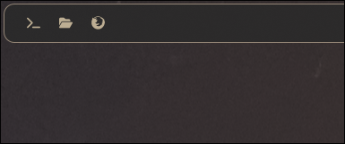

# Launcher

An app launcher for [Waybar](https://github.com/Alexays/Waybar), made with Rust.



## Installation

1. Install Rust, Waybar, Make
2. Prepare environment
   2. Add to your waybar config:
      ```jsonc
      "cffi/launcher": {
          "module_path": "/home/<yo_home_folder>/.config/waybar/custom/liblauncher.so",

          "spacing": 8, // spacing

          // Here you can add custom apps in format:
          "apps": [
              {
                  // command that will be executed:
                  "command": "hyprctl dispatch exec firefox",

                  // human readable name (used in format field):
                  "name": "Firefox",

                  // icon (used in format field)
                  "icon": ""
              },
              {
                  "command": "hyprctl dispatch exec kitty",
                  "name": "Kitty",
                  "icon": ""
              }
          ],

          // Button text format
          // Placeholders: {icon} {name}
          "format": "{icon}",
      }
      ```
   3. Add CSS (so they are looking nice).
      Here's my styles, that I use:
      ```css
      /* this is the box with buttons (apps) */
      #launcher {
          margin: 4px;
      }

      /* the button, app */
      #launcher button {
          min-width: 16px;
          padding: 5px 9px;

          border-radius: 8px;
          color: @fg3;
          font-weight: 300;
      }
      ```
3. Run:
   ```shell
   # NOTE: `make install`/`make install-dev` are copying `liblauncher.so` to `~/.config/waybar/custom` folder.
   #       So you can either create that folder, or change it in `Makefile`.
    
   make install      # release (recommended)
   make install-dev  # debug + unoptimized
   ```

## Development

1. Clone it
2. Use `make install-dev` to build and copy module to `~/.config/waybar/custom`
3. Make changes
4. Format with `make format` and clean with `make fix`
5. Create PRs
6. PROFIT
